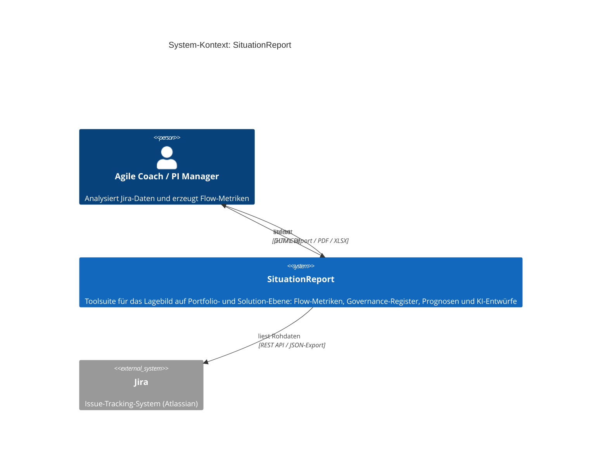
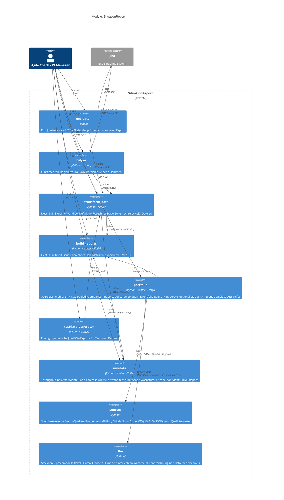
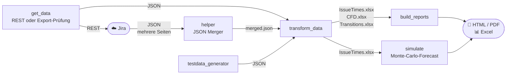
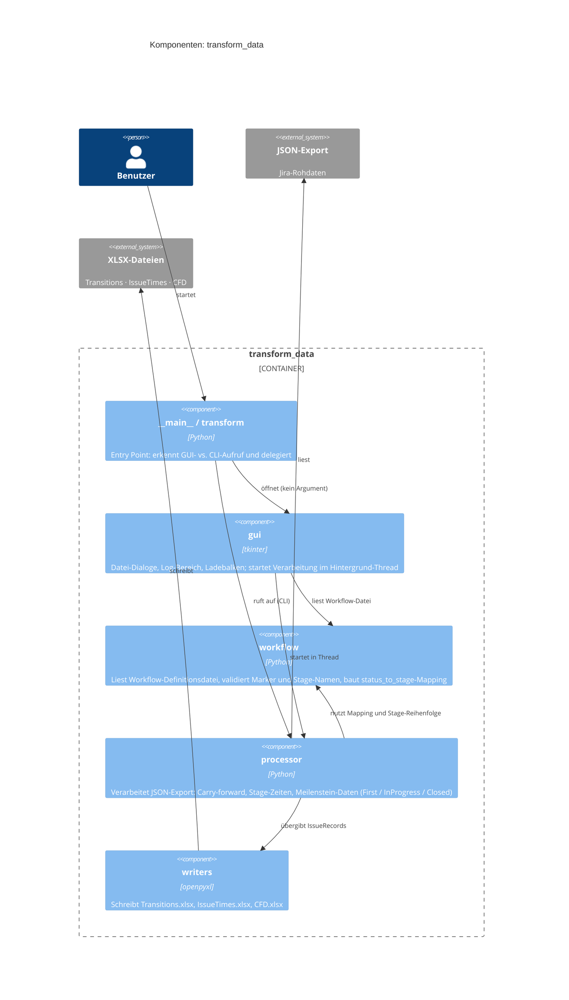
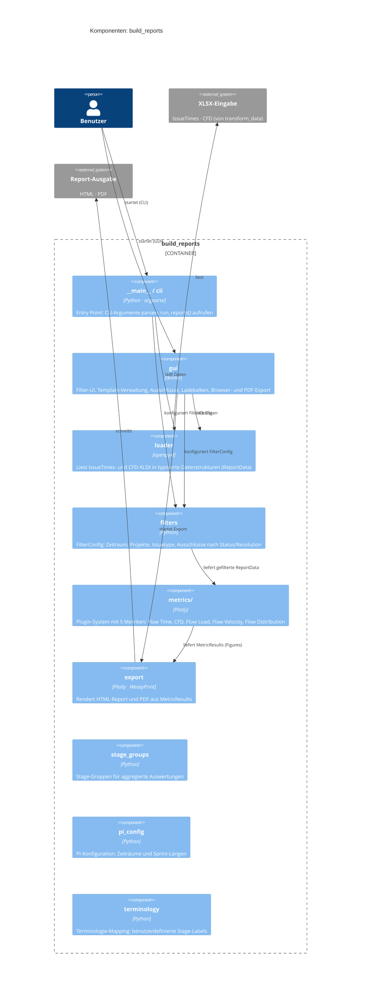
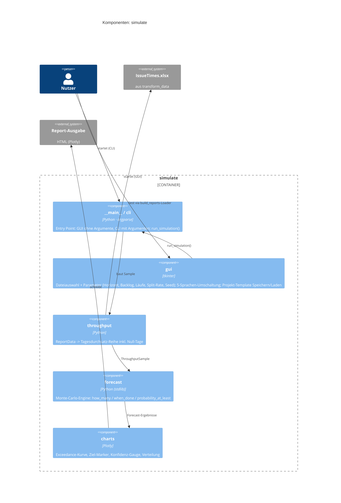

# Architektur

SituationReport folgt dem **C4-Modell** (Simon Brown): Kontext → Module → Komponenten.
Die Diagramme zeigen drei Detailstufen — von der Vogelperspektive bis auf Dateiebene.

---

## Level 1 — System-Kontext

Wer benutzt das System und mit welchen externen Systemen interagiert es?

---

## Level 2 — Module (Container)

Welche Module gibt es, welche Technologien nutzen sie und wie fließen Daten?

### Datenfluss

---

## Level 3 — Komponenten: transform_data

| Datei | Verantwortung |
|-------|--------------|
| `__main__.py` / `transform.py` | Entry Point; erkennt GUI- vs. CLI-Modus |
| `gui.py` | tkinter-Oberfläche; Background-Thread; Ladebalken nach 3 s |
| `workflow.py` | Workflow-Definitionsdatei lesen, validieren, Mapping aufbauen |
| `processor.py` | Jira-JSON verarbeiten; Stage-Zeiten, Carry-forward, Meilenstein-Fallbacks |
| `writers.py` | XLSX-Ausgabe (Transitions, IssueTimes, CFD) |

---

## Level 3 — Komponenten: build_reports

| Datei / Verzeichnis | Verantwortung |
|--------------------|--------------|
| `__main__.py` / `cli.py` | Entry Point; argparse; `run_reports()` |
| `gui.py` | tkinter-Oberfläche; Templates; Ausschlüsse; Ladebalken; Browser-/PDF-Export |
| `loader.py` | XLSX einlesen → `ReportData` (typisierte Dataclasses) |
| `filters.py` | `FilterConfig`; `apply_filters()`; Ausschluss-Logik |
| `metrics/base.py` | Abstrakte `MetricPlugin`-Klasse + `MetricResult`-Container |
| `metrics/*.py` | Konkrete Metriken: `flow_time`, `cfd`, `flow_load`, `flow_velocity`, `flow_distribution` |
| `export.py` | HTML-Rendering; PDF-Export via WeasyPrint |
| `stage_groups.py` | Stage-Gruppen-Definition |
| `pi_config.py` | PI-Zeiträume, Sprint-Längen |
| `terminology.py` | Benutzerdefinierte Terminologie |

---

## Level 3 — Komponenten: simulate

| Datei | Verantwortung |
|------|---------------|
| `__main__.py` / `cli.py` | Entry Point; argparse; `run_simulation()` |
| `gui.py` | tkinter-Oberfläche (5 Sprachen per Flaggen-Umschalter); Parameter; Projekt-Template Speichern/Laden (`project_template`, `MODULE_SIMULATE`); HTML-Report + Browser |
| `throughput.py` | `ReportData` → Tagesdurchsatz-Reihe (inkl. Null-Tage) |
| `forecast.py` | Monte-Carlo-Engine: `how_many`, `when_done` (Scope-Wachstum), `probability_at_least` |
| `charts.py` | Plotly: Exceedance-Kurve, Ziel-Marker, Konfidenz-Gauge, Termin-Verteilung |

Reine Standardbibliothek (`random`, `bisect`, `statistics`) — kein numpy/pandas —
für maximale Portabilität; nutzt `build_reports.loader` zum Einlesen der Eingabe.
