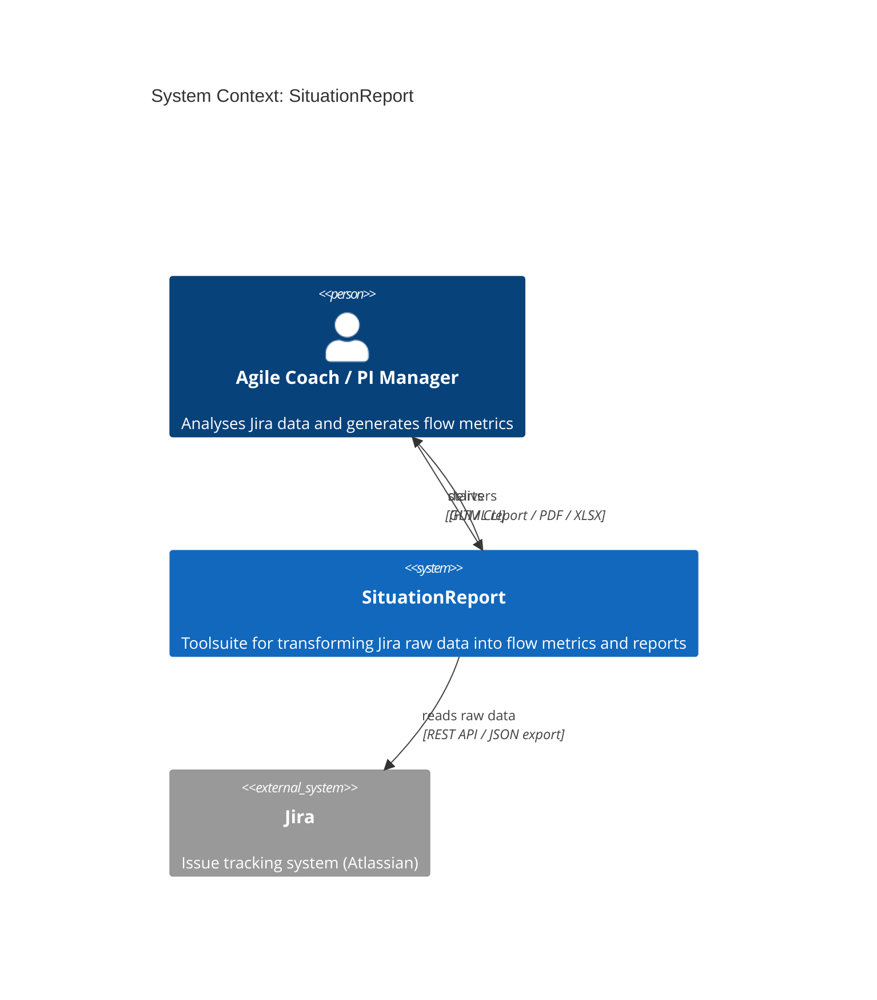
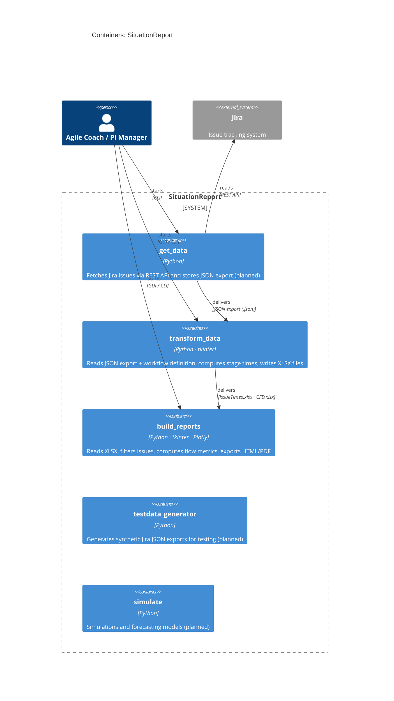
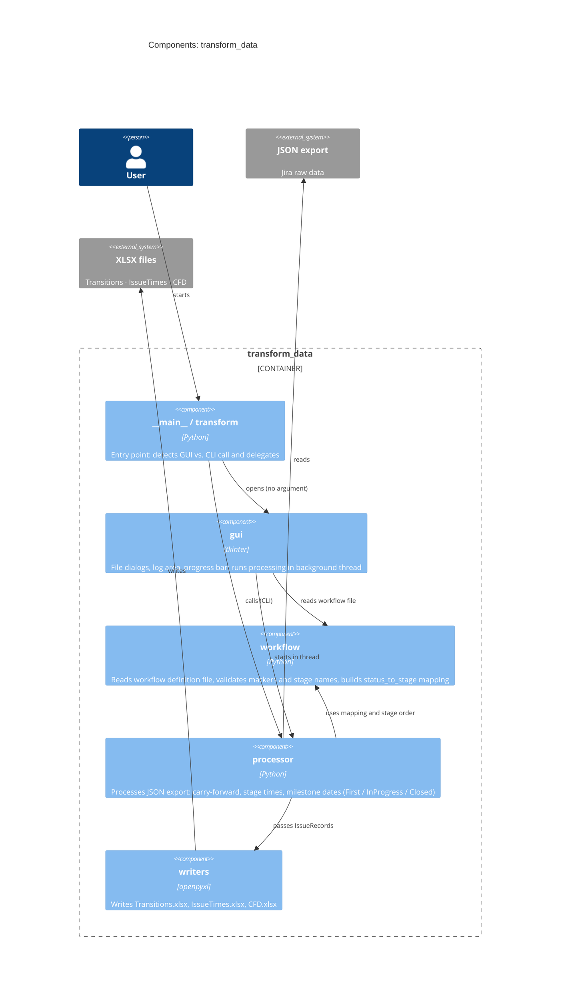
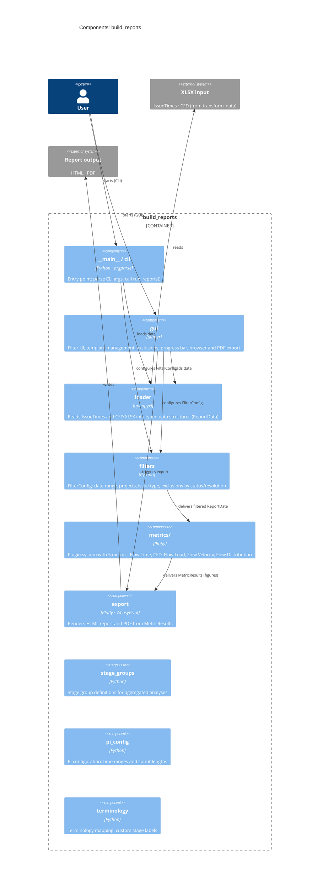

# Architecture

SituationReport follows the **C4 model** (Simon Brown): Context → Containers → Components.
The diagrams show three levels of detail — from the bird's-eye view down to individual files.

---

## Level 1 — System Context

Who uses the system and what external systems does it interact with?



---

## Level 2 — Containers (Modules)

What modules exist, what technologies do they use, and how does data flow?



### Data flow

```
Jira
  │  JSON export
  ▼
get_data  ──►  transform_data  ──►  build_reports
                 │                        │
                 │  Transitions.xlsx       │  HTML report
                 │  IssueTimes.xlsx        │  PDF export
                 └  CFD.xlsx             ◄─┘
```

---

## Level 3 — Components: transform_data



| File | Responsibility |
|------|---------------|
| `__main__.py` / `transform.py` | Entry point; detects GUI vs. CLI mode |
| `gui.py` | tkinter UI; background thread; progress bar after 3 s |
| `workflow.py` | Read, validate, and map workflow definition file |
| `processor.py` | Process Jira JSON; stage times, carry-forward, milestone fallbacks |
| `writers.py` | XLSX output (Transitions, IssueTimes, CFD) |

---

## Level 3 — Components: build_reports



| File / Directory | Responsibility |
|-----------------|---------------|
| `__main__.py` / `cli.py` | Entry point; argparse; `run_reports()` |
| `gui.py` | tkinter UI; templates; exclusions; progress bar; browser/PDF export |
| `loader.py` | Read XLSX → `ReportData` (typed dataclasses) |
| `filters.py` | `FilterConfig`; `apply_filters()`; exclusion logic |
| `metrics/base.py` | Abstract `MetricPlugin` class + `MetricResult` container |
| `metrics/*.py` | Concrete metrics: `flow_time`, `cfd`, `flow_load`, `flow_velocity`, `flow_distribution` |
| `export.py` | HTML rendering; PDF export via WeasyPrint |
| `stage_groups.py` | Stage group definitions |
| `pi_config.py` | PI time ranges, sprint lengths |
| `terminology.py` | Custom terminology |
