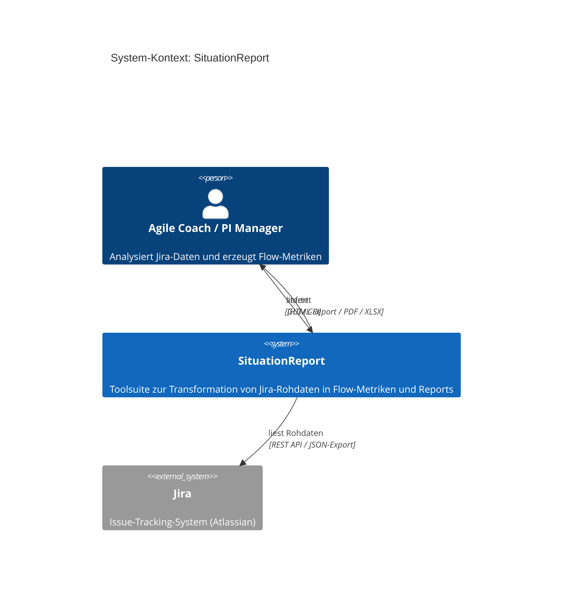
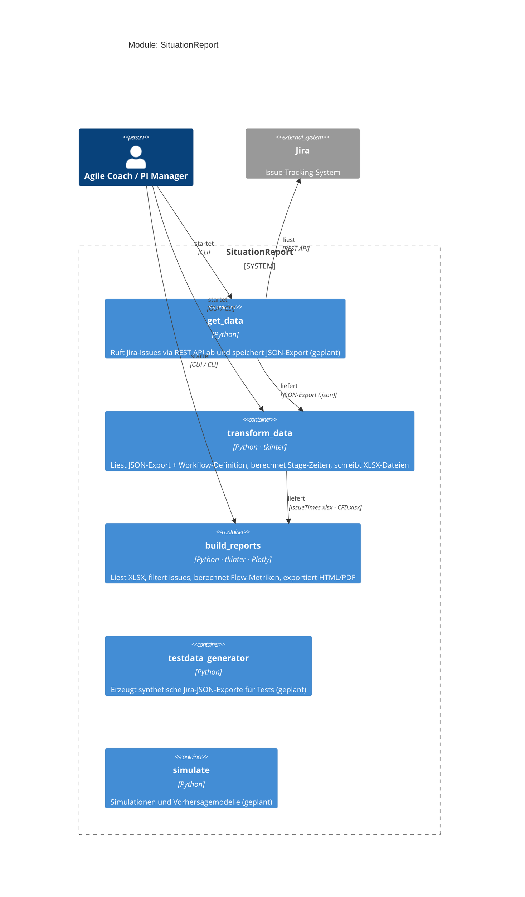
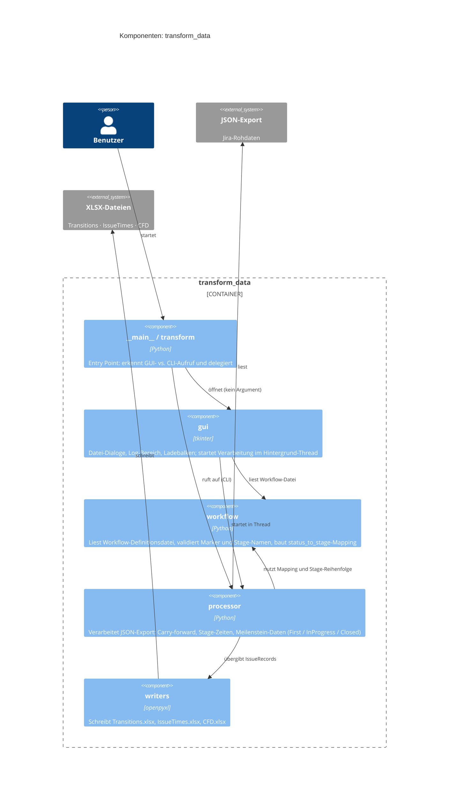
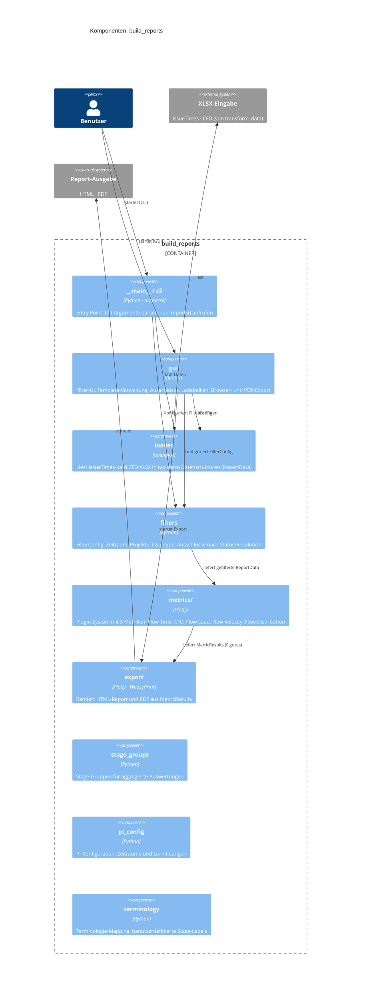

# Architektur

SituationReport folgt dem **C4-Modell** (Simon Brown): Kontext → Module → Komponenten.
Die Diagramme zeigen drei Detailstufen — von der Vogelperspektive bis auf Dateiebene.

---

## Level 1 — System-Kontext

Wer benutzt das System und mit welchen externen Systemen interagiert es?



---

## Level 2 — Module (Container)

Welche Module gibt es, welche Technologien nutzen sie und wie fließen Daten?



### Datenfluss

```
Jira
  │  JSON-Export
  ▼
get_data  ──►  transform_data  ──►  build_reports
                 │                        │
                 │  Transitions.xlsx       │  HTML-Report
                 │  IssueTimes.xlsx        │  PDF-Export
                 └  CFD.xlsx             ◄─┘
```

---

## Level 3 — Komponenten: transform_data



| Datei | Verantwortung |
|-------|--------------|
| `__main__.py` / `transform.py` | Entry Point; erkennt GUI- vs. CLI-Modus |
| `gui.py` | tkinter-Oberfläche; Background-Thread; Ladebalken nach 3 s |
| `workflow.py` | Workflow-Definitionsdatei lesen, validieren, Mapping aufbauen |
| `processor.py` | Jira-JSON verarbeiten; Stage-Zeiten, Carry-forward, Meilenstein-Fallbacks |
| `writers.py` | XLSX-Ausgabe (Transitions, IssueTimes, CFD) |

---

## Level 3 — Komponenten: build_reports



| Datei / Verzeichnis | Verantwortung |
|--------------------|--------------|
| `__main__.py` / `cli.py` | Entry Point; argparse; `run_reports()` |
| `gui.py` | tkinter-Oberfläche; Templates; Ausschlüsse; Ladebalken; Browser-/PDF-Export |
| `loader.py` | XLSX einlesen → `ReportData` (typisierte Dataclasses) |
| `filters.py` | `FilterConfig`; `apply_filters()`; Ausschluss-Logik |
| `metrics/base.py` | Abstrakte `MetricPlugin`-Klasse + `MetricResult`-Container |
| `metrics/*.py` | Konkrete Metriken: `flow_time`, `cfd`, `flow_load`, `flow_velocity`, `flow_distribution` |
| `export.py` | HTML-Rendering; PDF-Export via WeasyPrint |
| `stage_groups.py` | Stage-Gruppen-Definition |
| `pi_config.py` | PI-Zeiträume, Sprint-Längen |
| `terminology.py` | Benutzerdefinierte Terminologie |
