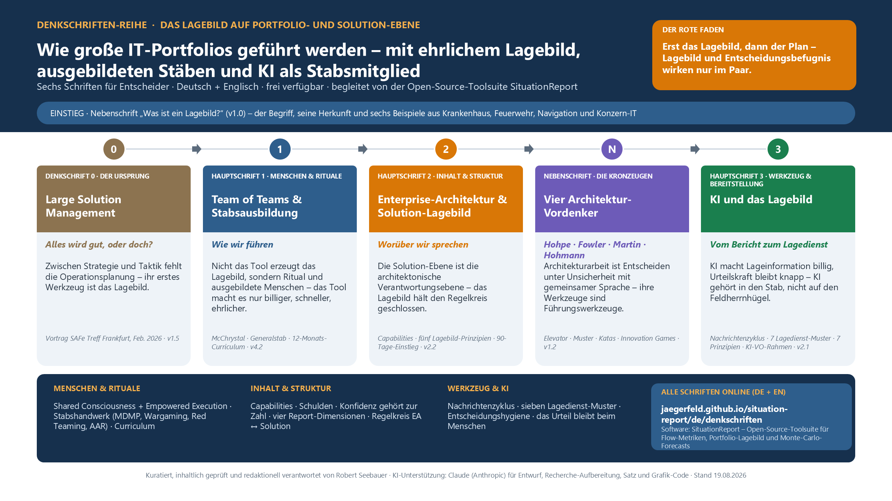

# Die Denkschriften-Reihe

Die SituationReport-Software ist das Werkzeug – die **Denkschriften** sind ihr fachliches Fundament. Die Reihe untersucht, wie große IT-Portfolios und Solutions geführt werden: mit einem ehrlichen **Lagebild**, ausgebildeten **Stäben** und zuletzt **KI als Stabsmitglied**. Alle Schriften richten sich an Entscheider und setzen kein militärisches, agiles oder KI-Vorwissen voraus.

Jede Schrift steht hier in ihrer aktuellen Fassung als PDF bereit (Deutsch und Englisch). Kuratiert und verantwortet von Robert Seebauer, erstellt mit Unterstützung von Claude (Anthropic) – Einzelheiten im [Transparenzhinweis](#transparenzhinweis) unten.

*Die Reihe auf einen Blick: fünf Schriften in ihrer Reihenfolge, je mit dem wichtigsten Satz – vom Ursprungs-Vortrag bis zur KI-Denkschrift. Zum Vergrößern anklicken.*

??? info "Die Zusammenhänge im Detail: die Mindmap der Reihe"
    

    *Schriften (rechts), Fundament und Werkzeug (links), Querverbindungen (gestrichelt). Zum Vergrößern anklicken.*

---

## Denkschrift 0 · Der Ursprung

**Large Solution Management – Alles wird gut, oder doch?**
*Version 1.5 · 19.08.2026 · 18 Seiten – Vortrag vom SAFe Treff, 26.02.2026, Frankfurt am Main*

!!! quote "Wichtigster Einzelsatz"
    Zwischen Strategie und Taktik fehlt die Operationsplanung – und ihr erstes Werkzeug ist das Lagebild: Wer nicht weiß, wo er steht, braucht niemandem zu sagen, wohin er laufen soll.

Der Vortrag, mit dem alles begann: die fehlende Operationsplanungs-Schicht, die vier Wissensfelder Flow · Quality · Value · Dependencies, Können statt Regeln – samt aller Originalfolien und einer Flyer-Übersicht der Reihe.

**Download:** [PDF Deutsch](pdf/Denkschrift-0_Large-Solution-Management_v1.5.pdf) · [PDF English](pdf/Memorandum-0_Large-Solution-Management_v1.5-en.pdf)
**Software-Bezug:** Aus den vier Wissensfeldern wurde die [Modul-Übersicht](../modules/index.md) dieser Toolsuite.

---

## Nebenschrift · Der Begriff

**Was ist ein Lagebild? Der Begriff, seine Herkunft – und sechs Beispiele aus Krankenhaus, Feuerwehr, Navigation und Konzern-IT**
*Version 1.0 · 19.08.2026 · 9 Seiten – für Leserinnen und Leser ohne militärischen Hintergrund*

!!! quote "Wichtigster Einzelsatz"
    Ein Lagebild ist keine Sammlung von Zahlen, sondern die geteilte, ehrliche Antwort auf drei Fragen – wo stehen wir, was hat sich geändert, was folgt daraus – aufbereitet, damit jemand entscheiden kann.

Die Begriffserklärung, die alle anderen Schriften voraussetzen – entstanden auf Rückfrage aus der Veröffentlichung der Reihe: Herkunft (Lage, Lagebild, Lagebeurteilung, Lagevortrag, Lagedienst), Abgrenzung zu Statusbericht, Dashboard und KPI-Report, sechs Merkmale als Checkliste, der Führungsvorgang als Regelkreis – und sechs Beispiele: Schichtübergabe (SBAR), Feuerwehr-Lagekarte, Navigation, ein vollständiges Portfolio-Lagebild auf einer Seite, das Delta-Briefing und drei Gegenbeispiele. Mit Anleitung: die erste Lagebild-Seite in einer Woche.

**Download:** [PDF Deutsch](pdf/Was-ist-ein-Lagebild_v1.0.pdf) · [PDF English](pdf/What-is-a-Situational-Picture_v1.0-en.pdf)
**Software-Bezug:** Das Beispiel-Lagebild in Teil C ist die Seite, die [`portfolio`](../modules/portfolio.md) und [`simulate`](../modules/simulate.md) erzeugen – Zahl und Konfidenz aus der Software, die dritte Frage vom Stab.

---

## Hauptschrift 1 · Menschen & Rituale

**Team of Teams & die Ausbildung von Stäben und Operationsplanern**
*Version 4.2 · 18.08.2026 · 19 Seiten*

!!! quote "Wichtigster Einzelsatz"
    Nicht das Reporting-Tool erzeugt das Lagebild, sondern das *Ritual* und die *ausgebildeten Menschen* darum herum – das Tool macht das Ritual nur billiger, schneller und ehrlicher.

Was Portfolios von McChrystals Team of Teams und 200 Jahren Generalstabsausbildung lernen: geteiltes Lagebild plus dezentrale Entscheidung, Stabsarbeit als lehrbares Handwerk – mit 12-Monats-Curriculum und Einstieg für Eilige.

**Download:** [PDF Deutsch](pdf/Team-of-Teams-und-Stabsausbildung_v4.2.pdf) · [PDF English](pdf/Team-of-Teams-and-Staff-Training_v4.2-en.pdf)
**Software-Bezug:** Der aggregierte Report ist das O&I-Artefakt; [`simulate`](../modules/simulate.md) liefert das quantitative Wargaming.

---

## Hauptschrift 2 · Inhalt & Struktur

**Enterprise-Architektur & das Lagebild auf der Solution-Ebene**
*Version 2.2 · 18.08.2026 · 11 Seiten*

!!! quote "Wichtigster Einzelsatz"
    Die Solution-Ebene ist keine „Koordinationsschicht", sondern die architektonische Verantwortungsebene: Sie hält den Regelkreis zwischen Strategie (EA) und Umsetzung (ARTs) geschlossen – und das Lagebild ist das Instrument, mit dem sie das tut.

Der Regelkreis EA ↔ Solution, Capabilities als gemeinsame Sprache, fünf Lagebild-Prinzipien und die vier Report-Dimensionen jenseits der Flow-Metriken – mit 90-Tage-Einstieg.

**Download:** [PDF Deutsch](pdf/Enterprise-Architektur-und-Solution-Lagebild_v2.2.pdf) · [PDF English](pdf/Enterprise-Architecture-and-Solution-Situational-Picture_v2.2-en.pdf)
**Software-Bezug:** Das [`portfolio`](../modules/portfolio.md)-Modul setzt das Solution-Lagebild um; die EA-Dimensionen bilden seine Roadmap.

---

## Nebenschrift · Die zivilen Kronzeugen

**Vier Architektur-Vordenker im Detail: Hohpe · Fowler · Martin · Hohmann**
*Version 1.2 · 18.08.2026 · 13 Seiten*

!!! quote "Wichtigster Einzelsatz"
    Vier Wege, ein Ziel: Architekturarbeit ist Entscheiden unter Unsicherheit mit gemeinsamer Sprache – ihre Werkzeuge (Muster, Optionen, Grenzen, Spiele) sind darum Führungs- und Stabswerkzeuge, keine Technik-Interna.

Die Detailausarbeitung zu den vier Vordenkern, die die Reihe als Kronzeugen tragen – Werke, Kernkonzepte und sechs direkt umsetzbare Software-Ableitungen.

**Download:** [PDF Deutsch](pdf/Architektur-Vordenker_v1.2.pdf) · [PDF English](pdf/Architecture-Thought-Leaders_v1.2-en.pdf)
**Software-Bezug:** Trend-Spalten, Schulden-Quadrant und Strangler-Metrik sind als Roadmap-Ableitungen im [`portfolio`](../modules/portfolio.md)-Umfeld verankert.

---

## Hauptschrift 3 · Werkzeug & Bereitstellung

**KI und das Lagebild – Vom Bericht zum Lagedienst**
*Version 2.1 · 18.08.2026 · 20 Seiten*

!!! quote "Wichtigster Einzelsatz"
    KI macht Lageinformation billig, Urteilskraft bleibt knapp – deshalb gehört KI in den Stab, nicht auf den Feldherrnhügel, und ihr größter Hebel ist die Bereitstellung: die richtige Information, zur richtigen Zeit, in der Sprache des Empfängers.

Inwieweit KI beim Erstellen und vor allem beim **Bereitstellen** von Lageinformationen hilft: Nachrichtenzyklus, vier KI-Rollen, sieben Lagedienst-Muster, sieben KI-Prinzipien – seit v2.0 mit dem **Urteilskraft-Block** (Zerlegung jeder Entscheidung in sechs Bestandteile, Bias ≠ Noise und Entscheidungshygiene, gezackte Grenze) und der Zuordnung, wo Software, KI und Mensch je Entscheidungsbestandteil hingehören – mit 90-Tage-Pilot inkl. Noise-Audit und Governance-Katalog; seit v2.1 mit dem **Rechtsrahmen der KI-Verordnung** (Stand August 2026: Betreiberpflichten, Transparenz, Hochrisiko-Falle Personenbezug) und rechtlichen Leitplanken für die Software.

**Download:** [PDF Deutsch](pdf/KI-und-Lagebild_v2.1.pdf) · [PDF English](pdf/AI-and-the-Situational-Picture_v2.1-en.pdf)
**Software-Bezug:** Die sieben Lagedienst-Muster definieren die KI-Phase der Portfolio-Roadmap (Pilot: Delta-Briefing); [`simulate`](../modules/simulate.md) bleibt der deterministische Kern, den KI erklärt, aber nie ersetzt.

---

## Versionierte Stände

Online steht immer die **aktuelle Fassung** jeder Schrift. Eingefrorene Stände gibt es als [GitHub-Releases mit dem Tag-Schema `denkschriften/<Datum>`](https://github.com/Jaegerfeld/situation-report/releases) – jede PDF-Datei trägt ihre Version zudem im Dateinamen und in der Versionshistorie auf der letzten Seite.

## Transparenzhinweis

Alle Schriften der Reihe wurden mit Unterstützung eines KI-Systems (Claude, Anthropic – Modelle Claude Opus 4.8 und Claude Fable 5, via Claude Code) erstellt: Entwurf, Recherche-Aufbereitung, Satz und Grafik-Code. Alle Inhalte wurden von Robert Seebauer inhaltlich geprüft, redaktionell bearbeitet und freigegeben; er trägt die redaktionelle Verantwortung. Die Reihe praktiziert damit, was ihre KI-Denkschrift fordert: KI ist Stabsmitglied, nicht Kommandeur – und die Freigabe durch den Menschen ist der letzte Schritt vor jeder Veröffentlichung.
