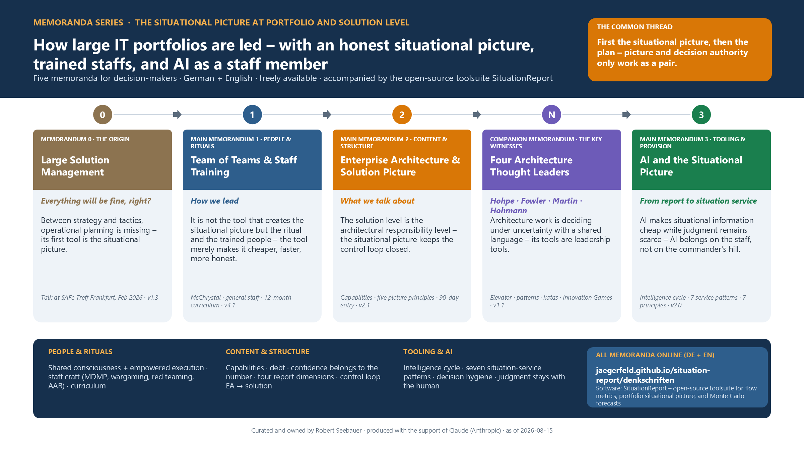
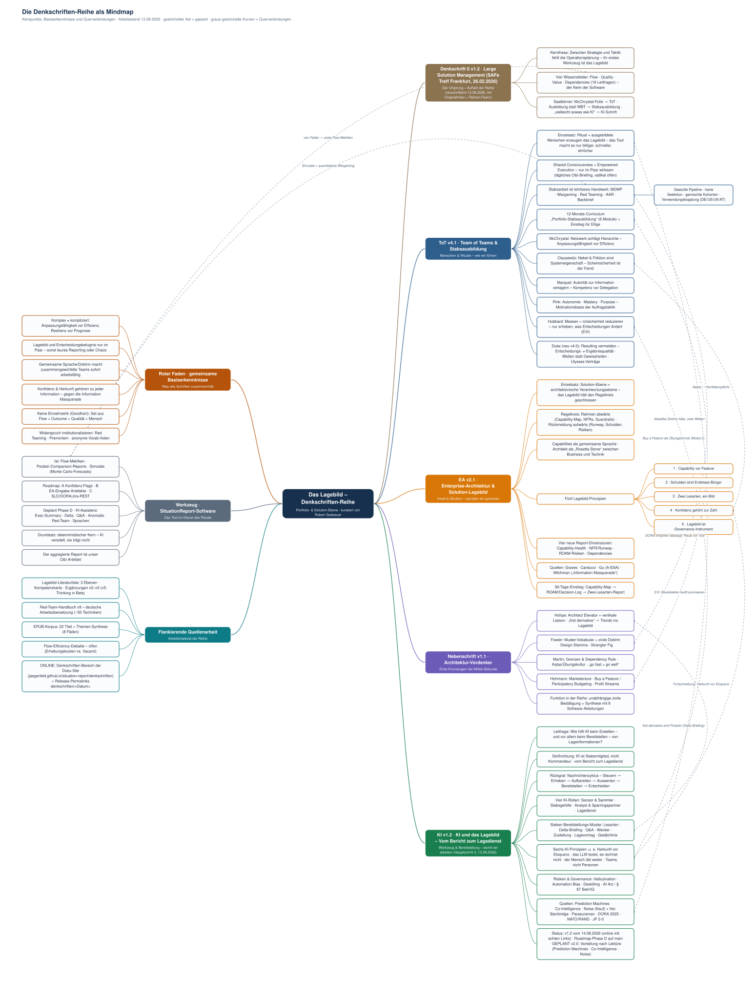

# The Memoranda Series

The SituationReport software is the tool – the **memoranda** are its conceptual foundation. The series examines how large IT portfolios and solutions are led: with an honest **situational picture**, trained **staffs**, and most recently **AI as a staff member**. All memoranda address decision-makers and require no military, agile, or AI background.

Each memorandum is available here in its current edition as a PDF (German and English). Curated and owned by Robert Seebauer, produced with the support of Claude (Anthropic).

*The series at a glance: five memoranda in sequence, each with its single most important sentence – from the original talk to the AI memorandum. Click to enlarge.*

??? info "The connections in detail: the series mind map"
    

    *The memoranda (right), foundation and tooling (left), cross-connections (dashed). Click to enlarge. The mind map is maintained in German – the memoranda themselves are fully bilingual.*

---

## Memorandum 0 · The Origin

**Large Solution Management – Everything Will Be Fine, Right?**
*Version 1.3 · 2026-08-15 · 16 pages – talk given at the SAFe Treff, Frankfurt am Main, February 26, 2026*

!!! quote "The single most important sentence"
    Between strategy and tactics, operational planning is missing – and its first tool is the situational picture: if you do not know where you stand, you need not tell anyone where to march.

The talk that started everything: the missing operational-planning layer, the four knowledge fields Flow · Quality · Value · Dependencies, competence instead of rules – including all original slides and a one-page flyer for every memorandum.

**Download:** [PDF German](pdf/Denkschrift-0_Large-Solution-Management_v1.3.pdf) · [PDF English](pdf/Memorandum-0_Large-Solution-Management_v1.3-en.pdf)
**Software connection:** The four knowledge fields grew into this toolsuite's [module overview](../modules/index.md).

---

## Main Memorandum 1 · People & Rituals

**Team of Teams & the Training of Staffs and Operational Planners**
*Version 4.1 · 2026-08-14 · 19 pages*

!!! quote "The single most important sentence"
    It is not the reporting tool that creates the operating picture, but the *ritual* and the *trained people* around it – the tool (our software) merely makes the ritual cheaper, faster and more honest.

What portfolios can learn from McChrystal's Team of Teams and 200 years of general-staff training: a shared operating picture plus decentralized decision-making, and staff work as a teachable craft – including a 12-month curriculum and a quick-start path.

**Download:** [PDF German](pdf/Team-of-Teams-und-Stabsausbildung_v4.1.pdf) · [PDF English](pdf/Team-of-Teams-and-Staff-Training_v4.1-en.pdf)
**Software connection:** The aggregated report is the O&I artifact; [`simulate`](../modules/simulate.md) provides the quantitative wargaming.

---

## Main Memorandum 2 · Content & Structure

**Enterprise Architecture & the Situational Picture at the Solution Level**
*Version 2.1 · 2026-08-14 · 10 pages*

!!! quote "The single most important sentence"
    The solution level is not a "coordination layer" but the architectural responsibility level: it keeps the control loop between strategy (EA) and delivery (the ARTs) closed – and the situational picture is the instrument with which it does so.

The EA ↔ solution control loop, capabilities as a shared language, five situational-picture principles, and the four report dimensions beyond flow metrics – with a 90-day entry path.

**Download:** [PDF German](pdf/Enterprise-Architektur-und-Solution-Lagebild_v2.1.pdf) · [PDF English](pdf/Enterprise-Architecture-and-Solution-Situational-Picture_v2.1-en.pdf)
**Software connection:** The [`portfolio`](../modules/portfolio.md) module implements the solution situational picture; the EA dimensions shape its roadmap.

---

## Side Memorandum · The Civilian Key Witnesses

**Four Architecture Thought Leaders in Detail: Hohpe · Fowler · Martin · Hohmann**
*Version 1.1 · 2026-08-14 · 12 pages*

!!! quote "The single most important sentence"
    Four paths, one destination: architecture work is deciding under uncertainty with a shared language – its tools (patterns, options, boundaries, games) are therefore leadership and staff tools, not technology internals.

The in-depth treatment of the four thought leaders who serve as the series' key witnesses – their works, core concepts, and six directly actionable software derivations.

**Download:** [PDF German](pdf/Architektur-Vordenker_v1.1.pdf) · [PDF English](pdf/Architecture-Thought-Leaders_v1.1-en.pdf)
**Software connection:** Trend columns, the debt quadrant, and the strangler metric are anchored as roadmap derivations around the [`portfolio`](../modules/portfolio.md) module.

---

## Main Memorandum 3 · Tooling & Provision

**AI and the Situational Picture – From Report to Situation Service**
*Version 2.0 · 2026-08-15 · 19 pages*

!!! quote "The single most important sentence"
    AI makes situational information cheap while judgment remains scarce – therefore AI belongs on the staff, not on the commander's hill, and its greatest lever is provision: the right information, at the right time, in the language of the recipient.

To what extent AI helps create and above all **provide** situational information: the intelligence cycle, four AI roles, seven situation-service patterns, seven AI principles – since v2.0 with the **judgment block** (decomposing every decision into six components, bias ≠ noise and decision hygiene, the jagged frontier) and the mapping of where software, AI and humans belong per decision component – with a 90-day pilot including a noise audit and a governance catalogue.

**Download:** [PDF German](pdf/KI-und-Lagebild_v2.0.pdf) · [PDF English](pdf/AI-and-the-Situational-Picture_v2.0-en.pdf)
**Software connection:** The seven situation-service patterns define the AI phase of the portfolio roadmap (pilot: delta briefing); [`simulate`](../modules/simulate.md) remains the deterministic core that AI explains but never replaces.

---

## Versioned Editions

This page always offers the **current edition** of each memorandum. Frozen editions are published as [GitHub releases using the tag scheme `denkschriften/<date>`](https://github.com/Jaegerfeld/situation-report/releases) – in addition, every PDF carries its version in the file name and in the version history on its last page.
