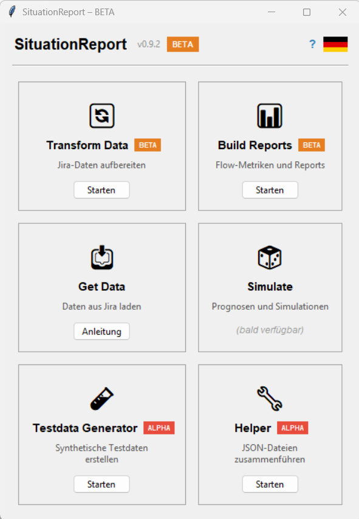

# launcher

Der `launcher` ist der zentrale Einstiegspunkt für SituationReport. Er zeigt alle verfügbaren und geplanten Module als Karten-Grid und ermöglicht den direkten Start per Klick.

**Start:**
```bash
python -m launcher
```

Oder über die Startdatei im portablen Paket:
- **Windows:** `SituationReport.bat`
- **macOS:** `SituationReport.command`
- **Linux:** `SituationReport.sh`

## Oberfläche



```
┌──────────────────────────────────────────┐
│  SituationReport  v0.9.2  BETA     ?  🌐 │
├──────────────────────────────────────────┤
│  ┌──────────────┐ ┌──────────────┐       │
│  │  🔄          │ │  📊          │       │
│  │Transform Data│ │ Build Reports│       │
│  │   [BETA]     │ │   [BETA]     │       │
│  │Jira aufberei.│ │Flow-Metriken │       │
│  │  [Starten]   │ │  [Starten]   │       │
│  └──────────────┘ └──────────────┘       │
│  ┌──────────────┐ ┌──────────────┐       │
│  │  📥          │ │  🎲          │       │
│  │  Get Data    │ │   Simulate   │       │
│  │ (bald verf.) │ │ (bald verf.) │       │
│  │  [Anleitung] │ │              │       │
│  └──────────────┘ └──────────────┘       │
│  ┌──────────────┐ ┌──────────────┐       │
│  │  🧪          │ │  🔧          │       │
│  │Testdata Gen. │ │   Helper     │       │
│  │  [ALPHA]     │ │   [ALPHA]    │       │
│  │  [Starten]   │ │  [Starten]   │       │
│  └──────────────┘ └──────────────┘       │
└──────────────────────────────────────────┘
```

## Module

| Modul | Status | Reifegrad | Beschreibung |
|-------|--------|-----------|-------------|
| `transform_data` | verfügbar | BETA | Jira-Rohdaten aufbereiten |
| `build_reports` | verfügbar | BETA | Flow-Metriken und Reports |
| `get_data` | geplant | — | Daten aus Jira laden |
| `simulate` | geplant | — | Prognosen und Simulationen |
| `testdata_generator` | verfügbar | ALPHA | Synthetische Testdaten erstellen |
| `helper` | verfügbar | ALPHA | JSON-Dateien zusammenführen |

## Verhalten

- Ein Klick auf **Starten** öffnet das Modul als **eigenständigen Prozess** in einem separaten Fenster.
- Der Launcher bleibt offen — mehrere Module können gleichzeitig geöffnet sein.
- Geplante Module sind sichtbar, aber nicht klickbar.
- **Get Data** zeigt einen **Anleitung**-Button: Öffnet einen Dialog mit dem manuellen 3-Schritt-Workaround (Jira-JSON exportieren → Helper → Transform Data), bis das Modul verfügbar ist.

## Reifegrad-Kennzeichnung

Der Launcher zeigt zwei Arten von Reifegrad-Badges:

- **App-Badge in der Titelleiste:** Orangefarbenes **BETA**-Badge signalisiert den aktuellen Reifegrad des Gesamtprojekts.
- **Modul-Badges auf den Karten:** Jedes verfügbare Modul trägt ein eigenes Badge neben dem Modulnamen:
  - **BETA** (orange) – `transform_data`, `build_reports`: stabile Kernfunktionen, produktionsreif
  - **ALPHA** (rot) – `testdata_generator`, `helper`: neu, experimentell, API kann sich noch ändern

## Update-Prüfung

Beim Start prüft der Launcher im Hintergrund, ob auf GitHub eine neuere Version verfügbar ist. Ist das der Fall, erscheint ein gelbes Banner oberhalb des Modul-Grids:

```
Update verfügbar: v0.9.2   [Herunterladen]
```

Ein Klick auf **Herunterladen** öffnet die GitHub-Release-Seite im Browser. Die Prüfung läuft ohne Netz-Anforderung — bei fehlendem Internet erscheint kein Fehler.

## Sprache

Die Sprache wird über den Flag-Button oben rechts umgeschaltet (DE → EN → RO → PT → FR → DE …).
Die Einstellung wird in `~/.situation_report/prefs.json` gespeichert und gilt für alle Module gemeinsam.

## Benutzerhandbuch

Der **?**-Button in der Titelleiste öffnet das Benutzerhandbuch als PDF im Browser (sprachabhängig: Deutsch oder Englisch).
