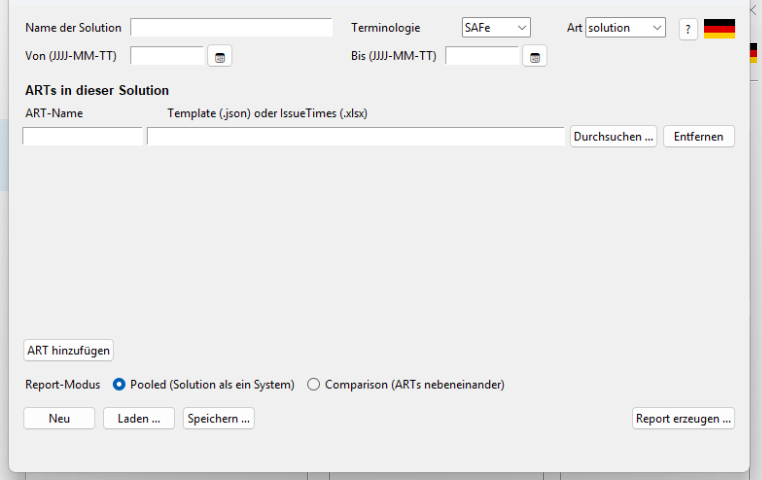

# portfolio

Aggregates several already-configured ARTs into a combined **Large-Solution** or
**Portfolio** report — as **pooled** (the solution seen as one system) or
**comparison** (units side by side). It reuses the `build_reports` metrics; the
individual ART reports are only referenced, not changed.

**Status:** available (Alpha)

## Manuals

| Language | Download |
|----------|----------|
| Deutsch (DE) | [Benutzerhandbuch](../portfolio_Benutzerhandbuch.pdf) |
| English (EN) | [User Manual](../portfolio_UserManual.pdf) |
| Română (RO) | [Manual de Utilizator](../portfolio_ManualUtilizator.pdf) |
| Português (PT) | [Manual do Utilizador](../portfolio_ManualUtilizador.pdf) |
| Français (FR) | [Manuel d'utilisation](../portfolio_ManuelUtilisateur.pdf) |

---

## Key concepts

| Term | Meaning |
|------|---------|
| ART | Agile Release Train / team group — the level you already report on in `build_reports`. |
| Solution | A grouping of several ARTs (references their project templates). |
| Portfolio | A grouping of several Solutions (Portfolio > Solutions > ARTs). |
| Pooled | Mode: all issues are merged into **one** dataset — the solution as a single system. |
| Comparison | Mode: each unit (ART or Solution) is shown separately, side by side. |

## Interface



## Start

### GUI

```bash
python -m portfolio
```

Or click the **Solutions & Portfolios** card on the left of the SituationReport
launcher.

### Command line

```bash
python -m portfolio solution.json --mode pooled --output report.html
# comparison mode / PDF output:
python -m portfolio solution.json --mode comparison --pdf report.pdf
```

The configuration file (`solution.json`) lists the members (ARTs for a solution,
Solutions for a portfolio) and is created/edited in the GUI.

## Report contents

Every report starts with the **management summary** — one row per unit (pooled:
the whole solution/portfolio): items, completed, open (WIP), cycle-time
percentiles (median/85th/95th), the target-CT share, and the **end-to-end lead
time** (Created → Closed, median/85th; in pooled mode the solution lead time
across all ARTs).

Below it, the **Data Quality per Source** table shows for every source: record
count, its **share** of all items, the share without a First Date, the open
share, whether CFD data was supplied, the data freshness — and a traffic-light
**confidence** (high/medium/low, thresholds documented in `summary.py`). The
title carries the coverage ratio ("x/y sources delivered data"). In the PDF the
table is page 2.

In **comparison** mode, Median-CT and 95th-percentile cells are highlighted
red when they exceed 1.5× the column median (three rows minimum) — the
"which unit is the outlier?" question answers itself.

## Capability map & health (optional)

A solution config may reference a capability map via
`"capabilities": "path/to/capabilities.json"`; the report then renders a
**Capability Map & Health** table below the quality table (PDF: own page). A
portfolio aggregates the maps of all member solutions and adds a **Solution**
column. The map:

```json
{
  "capabilities": [
    {
      "id": "C-1",
      "title": "Data insights & reporting",
      "health": "critical",
      "arts": ["ART Beta-3"],
      "owner": "ART Beta-3",
      "assessed_on": "2026-08-26",
      "notes": "optional"
    }
  ]
}
```

`health` is one of `healthy` / `at_risk` / `critical` — **assessed by people**
in PI planning/review (`assessed_on` records when). `arts` names the member
ARTs contributing to the capability; a capability with no contributing ARTs is
flagged as **uncovered** (business value nobody delivers), and an ART name
that is not among the solution's members is logged as a drift warning.
Critical capabilities sort first with coloured health cells; the title counts
critical/at-risk/uncovered. `owner` names a team, not a person. The capability
map (business capabilities) is deliberately **not** the `stage_map` (workflow
stages) — different dimension, different source. Missing or invalid files are
logged and skipped.

## ROAM risk board (optional)

A solution config may reference a risk register via `"risks": "path/to/risks.json"`;
the report then renders a **ROAM board** below the quality table and the
capability map (PDF: its own page). A portfolio aggregates the registers of all member solutions and adds a
**Solution** column. The register:

```json
{
  "risks": [
    {
      "id": "R-1",
      "title": "Test environment not ordered yet",
      "roam": "owned",
      "owner": "System Team",
      "impact": "high",
      "status_since": "2026-07-15",
      "notes": "optional"
    }
  ]
}
```

`roam` is one of `resolved` / `owned` / `accepted` / `mitigated`, `impact` one
of `high` / `medium` / `low`. Rows are grouped in R-O-A-M order with coloured
category and impact cells. `status_since` (when the risk entered its current
category) drives **aging**: an *owned* risk older than 30 days gets a red
"Since" cell — ownership without movement is exactly what the board surfaces.
The title counts total, owned, and aging risks. `owner` names a **team, not a
person**. A missing or invalid risks file is logged and skipped — governance
data never breaks the flow report.

## NFR / architecture-runway dashboard (optional)

A solution config may reference an NFR register via `"nfr": "path/to/nfr.json"`;
the report then renders an **NFR & Architecture Runway** dashboard below the
ROAM board (PDF: own page, both tables stacked). A portfolio aggregates the
registers of all member solutions and adds a **Solution** column. The register:

```json
{
  "nfrs": [
    {
      "id": "N-1",
      "title": "API response time",
      "target": "p95 < 200 ms",
      "actual": "p95 = 340 ms",
      "status": "violated",
      "owner": "ART Beta-1"
    }
  ],
  "runway": [
    {
      "id": "RW-1",
      "title": "Automated failover",
      "status": "gap",
      "needed_by": "2026-08-13",
      "owner": "ART Beta-2"
    }
  ]
}
```

NFR `status` is one of `met` / `at_risk` / `violated`, runway `status` one of
`in_place` / `building` / `gap` — **assessed by people** in PI planning/review;
the tool deliberately does not compute target vs. actual ("the LLM writes, it
does not calculate" applies to the tool as well). Violated NFRs and runway gaps
sort first with coloured status cells; a runway element whose `needed_by` has
passed while it is not in place renders as **overdue** (red date cell). The
title counts NFRs (violated/at risk) and runway elements (gaps/overdue).
`owner` names a team, not a person. Missing or invalid files are logged and
skipped.

## Dependency / integration heatmap (optional)

A solution config may reference a dependency register via
`"dependencies": "path/to/dependencies.json"`; the report then renders a
**Dependency & Integration Heatmap** below the NFR dashboard (PDF: own page).
A portfolio aggregates the registers of all member solutions and adds a
**Solution** column to the detail table. The register:

```json
{
  "dependencies": [
    {
      "id": "D-1",
      "title": "Billing API contract",
      "from": "ART Alpha-1",
      "to": "ART Alpha-3",
      "status": "blocked",
      "due": "2026-08-18",
      "notes": "optional"
    }
  ]
}
```

`from` needs something that `to` delivers; `status` is one of `blocked` /
`at_risk` / `on_track` / `done`. The **heatmap** counts open dependencies
(status ≠ done) per from/to pair — each cell carries the colour of its most
urgent status. Below it, the detail table lists every dependency (blocked
first); a dependency whose `due` has passed while not done renders as
**overdue** (red date cell). The title counts blocked/at-risk/overdue. `to`
is deliberately **not** validated against the member list — integration
points may target another solution's ART, a vendor, or an external system
(cross-solution dependencies become visible in the portfolio report). Missing
or invalid files are logged and skipped.

## Decision / assumption log (optional)

A solution config may reference a decision log via
`"decisions": "path/to/decisions.json"`; the report then renders a
**Decision & Assumption Log** table below the dependency heatmap (PDF: own
page). A portfolio aggregates the logs of all member solutions and adds a
**Solution** column. The log — lightweight, ADR-style:

```json
{
  "entries": [
    {
      "id": "ADR-1",
      "kind": "decision",
      "title": "Buy vendor sync service instead of building",
      "status": "accepted",
      "owner": "ART Beta-1",
      "logged_on": "2026-04-05",
      "supersedes": "ADR-0",
      "notes": "optional"
    },
    {
      "id": "AS-1",
      "kind": "assumption",
      "title": "Data quality improves with the next rollout",
      "status": "open",
      "review_by": "2026-08-23"
    }
  ]
}
```

`kind` is `decision` (status `proposed` / `accepted` / `superseded`) or
`assumption` (status `open` / `confirmed` / `invalidated`) — the parser
enforces the matching status set. `supersedes` must name an entry in the same
log, keeping the trade-off trail intact. `review_by` gives an assumption its
expiry: an **open assumption whose review date has passed** sorts first and
gets a red "review due" cell — the hook for red-team/premortem sessions.
`owner` names a team, not a person. Missing or invalid files are logged and
skipped.

## Delta briefing (D2, deterministic core)

Two commands turn report states into a "what changed?" briefing:

```bash
python -m portfolio portfolio.json --snapshot state_now.json
python -m portfolio --delta state_prev.json state_now.json --output delta.html
```

`--snapshot` freezes the computed report state (metrics per unit and pooled,
source quality incl. confidence, all five governance registers) into a small
schema-v1 JSON; `--as-of YYYY-MM-DD` pins the observation date (default:
today). Without `--output`/`--pdf`, only the snapshot is written.

`--delta PREV NOW` needs no config: it compares two snapshots and emits the
briefing — metric deltas at display precision (invisible float changes are
dropped), throughput in the period, confidence transitions per source, and
per governance register the added/removed entries, status transitions
(worsenings first, red; improvements green) and **newly overdue** items
(judged against each snapshot's as-of date, so only genuine flips count).
`--output *.md` writes Markdown, any other suffix the self-contained HTML
page, no `--output` prints Markdown to stdout. A delta with no changes says
so explicitly — silence is information.

The Markdown output is deliberately the input contract for the optional LLM
narration layer (D2 part 2, not yet built): the LLM may rephrase it, never
add numbers — the numbers are made here, deterministically.

**In the GUI:** the manager window carries two matching buttons — **Save
snapshot …** freezes the currently configured solution/portfolio to a JSON
file (suggested name includes today's date), and **Delta briefing …** asks
for the earlier and the later snapshot and opens the briefing in the
browser. The demo path is even shorter: the test-data generator's
demo-portfolio section gains **Open Delta Briefing**, which renders the
scenario's shipped `snapshot_prev/now.json` pair directly.

## Flow-problem backlog & conference pre-read (optional, B6)

`"flow_problems": "flow_problems.json"` renders the **Flow-Problem
Backlog** — the Value-Stream Conference's most important input. Each
problem carries id, title, status (`open`/`committed`/`resolved`/
`dropped`), the affected `value_streams` (cross-VS is *derived*: more
than one stream), who raised it, the owning team, `raised_on`, a
`conferences` counter (in how many conferences it has been on the
table — maintained by people), `resolution_commitment` and
`follow_up_pi`. The workshop pattern "logged, never mitigated, back next
PI" becomes measurable: an unresolved problem seen in **≥ 3 conferences**
sorts first with a red counter.

The **conference pre-read** bundles the meeting inputs into one light,
printable page:

```bash
python -m portfolio portfolio.json --conference preread.html --conference-date 2026-09-10
```

Input 1 · current data (summary + source quality), Input 2 · impediment
backlog & governance (flow problems first, then ROAM and dependencies),
Input 3 · business objectives (capability map + SLOs), Input 4 · the
integrated roadmap & strategic themes (B7). The full interactive report
stays the detail source. **In the GUI:** the manager window's
*Conference pre-read …* button writes the same page for the currently
configured solution (filename suggests today's date) and opens it in
the browser — print to PDF from there; the test-data generator's demo
section has *Open Conference Pre-Read* for the one-click demo.

## Strategic themes & integrated roadmap (optional, B7)

`"themes": "themes.json"` gives strategic themes a structured home and
the solution level its integrated roadmap:

```json
{
  "themes": [{"id": "T-1", "title": "Digital ordering end-to-end"}],
  "epics": [
    {"id": "EP-1", "title": "Self-service portal", "train": "ART A",
     "horizon": "P1", "theme": "T-1", "status": "in_progress"},
    {"id": "EP-9", "title": "Legacy rewrite", "train": "ART C",
     "horizon": "Y1"}
  ]
}
```

Horizons follow *near-term granular, far-term coarse*: `P1 · P2 · Y1 ·
Y2 · Y3`. **Orphan detection works in both directions**: a theme no epic
pays into is flagged red as *declared & forgotten* (judged
portfolio-wide — an epic in another solution counts), and an epic with an
**empty** `theme` is a *zombie initiative* (a typo in the reference is a
validation error, not a zombie). The report renders the theme table, the
roadmap matrix (rows = trains, columns = horizons, zombies red) and the
zombie list; the conference pre-read carries it as Input 4. Roadmap epics
also flow into D2 snapshots, so the delta briefing documents the
*updated roadmaps* per conference (horizon shifts, status changes, a
lost strategic home reads as `→ zombie`).

## SLO & DORA registers (optional, C1/C2)

A solution config may reference two more registers, both produced by the
pluggable `sources` framework (see its module page for providers and the
30-line recipe for new sources):

- `"slo": "slo.json"` renders **Service Levels & Error Budgets**: per SLO
  the target, current SLI, remaining error budget (central rule:
  consumed = (100−SLI)/(100−target)) and a status — met / at risk (< 25 %
  budget left) / breached / unknown, breached first. Every data source is
  judged by the same rule.
- `"dora": "dora.json"` renders **Delivery Performance (DORA) & Code
  Quality**: the four DORA keys per unit, each cell tiered at the
  published thresholds (elite/high/medium/low), overall tier = the unit's
  worst metric; a quality table (coverage, maintainability rating,
  critical issues) follows.

Each row keeps its data source (combinable sources); a portfolio
aggregates member registers with a Solution column; broken files are
logged and skipped.

## Custom stage map (optional, config schema 2)

By default, differing ART workflows pool into the three canonical groups
To Do / In Progress / Done. A solution config may instead define its own
canonical stages:

```json
"stage_map": {
  "stages": {
    "Backlog":     ["Funnel", "Analysis"],
    "In progress": ["Implementing", "Review"],
    "Done":        ["Done", "Released"]
  },
  "first_stage": "In progress",
  "closed_stage": "Done"
}
```

`first_stage`/`closed_stage` mark the CFD boundaries. Source stages the map
does not mention fall into `first_stage` with a logged warning. Configs without
the block keep the previous behaviour unchanged (v1 files load as before).

## Architecture

```
portfolio/
├── __main__.py        Dispatcher: GUI without arguments, CLI with arguments
├── cli.py             run_solution_report() + argparse CLI
├── solution_config.py Solution/Portfolio config (members, mode, terminology)
├── risks_config.py    ROAM risk register (B3): schema, parse/load/save
├── nfr_config.py      NFR/runway register (B2): schema, parse/load/save
├── capability_config.py Capability map (B1): schema, parse/load/save
├── dependency_config.py Dependency register (B5): schema, parse/load/save
├── decision_config.py Decision/assumption log (B4): schema, parse/load/save
├── flow_problems_config.py Flow-problem backlog (B6): schema, survivor rule
├── themes_config.py   Strategic themes/roadmap (B7): orphan/zombie rules
├── slo_config.py      SLO register (C1): central budget/status rule
├── dora_config.py     Delivery register (C2): DORA tiers + quality
├── snapshot.py        Report snapshot (D2): freeze metrics/quality/governance
├── delta.py           Delta briefing (D2): diff two snapshots, HTML/Markdown
├── aggregator.py      Record-level pooling + rendering (HTML/PDF)
└── summary.py         Management summary + data quality (A1/A2), outliers (A3), ROAM board (B3), NFR dashboard (B2)
```

Reuses `build_reports` (loader, metrics, export). Aggregation is done by
**record pooling** — ART issues are merged at the record level and the existing
metrics run over them unchanged (a pooled median ≠ the mean of medians).

## Tests

```bash
python -m pytest tests/portfolio/
```
