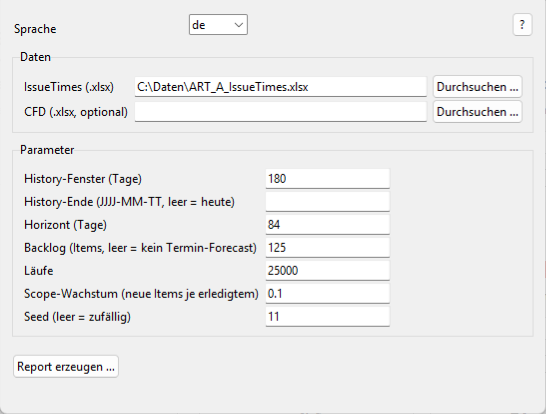

# simulate

Throughput-based Monte-Carlo forecast on historical Jira data. Answers two
questions probabilistically — **without story-point estimation** — and derives a
scope-confidence view from the same runs.

**Status:** available (Alpha)

## Manuals

| Language | Download |
|----------|----------|
| Deutsch (DE) | [Benutzerhandbuch](../simulate_Benutzerhandbuch.pdf) |
| English (EN) | [User Manual](../simulate_UserManual.pdf) |
| Română (RO) | [Manual de Utilizator](../simulate_ManualUtilizator.pdf) |
| Português (PT) | [Manual do Utilizador](../simulate_ManualUtilizador.pdf) |
| Français (FR) | [Manuel d'utilisation](../simulate_ManuelUtilisateur.pdf) |

---

## What it answers

- **How many items** will we complete in a given period? (capacity forecast)
- **When will** a backlog of N items **be done**? (date forecast, optionally with
  scope growth via a split rate)
- **Will we finish the scope by date X?** — a confidence gauge derived from the
  same runs (the point of the exceedance curve at the backlog size).

Results are shown as **exceedance percentiles** with reference lines at
85 / 75 / 50 %, e.g. "at least X items with 85 % confidence" or "done by day Y at
the latest".

## Interface



## Start

### GUI

```bash
python -m simulate
```

Or launch the **Simulate** card from the SituationReport launcher.

### Command line

```bash
python -m simulate ART_A_IssueTimes.xlsx \
    --horizon 84 --backlog 125 --split-rate 0.1 \
    --runs 25000 --seed 11 --output forecast.html
```

## Parameters

| Parameter | Default | Description |
|-----------|---------|-------------|
| `issue_times` | (required) | Path to the `IssueTimes.xlsx` file |
| `--cfd FILE` | (none) | Optional `CFD.xlsx` |
| `--history-days N` | `180` | History window length in days |
| `--history-end YYYY-MM-DD` | today | Exclusive end of the history window |
| `--horizon DAYS` | `84` | Forecast horizon (capacity forecast) |
| `--backlog N` | (none) | Also run the date + scope-confidence forecast for N items |
| `--runs N` | `25000` | Number of Monte-Carlo runs |
| `--split-rate R` | `0.0` | Expected new items per completed item (scope growth) |
| `--seed N` | (random) | Seed for reproducible runs |
| `--output FILE` | (none) | Write the HTML report to this file |
| `--browser` | off | Open the written report in the browser |

## Method

Standard library only (no numpy/pandas) for maximum portability. The empirical
daily-throughput distribution is built from the history window — **including
zero-throughput days**, so the forecast is not biased upward — and resampled
across `runs` runs (`random.choices`, reproducible via a seed). The date forecast
optionally grows the remaining scope by `split_rate` per completed item; its
percentiles are ranked over **all** runs, so a confidence above the completion
rate reads "≥ cap" instead of an over-optimistic day. Inspired by the team's R
prototype and by Daniel Vacanti, *Actionable Agile Metrics for Predictability*.

## Architecture

```
simulate/
├── __main__.py     Dispatcher: GUI without arguments, CLI with arguments
├── cli.py          run_simulation() + argparse CLI
├── forecast.py     Monte-Carlo engine (how_many / when_done / probability_at_least)
├── throughput.py   ReportData -> daily throughput series (incl. zero days)
├── charts.py       Plotly: exceedance curve, target marker, gauge, distribution
└── gui.py          tkinter GUI (de/en)
```

The engine reuses `build_reports.loader.ReportData`; the throughput adapter turns
loaded issues into the daily series the engine samples from.

## Tests

```bash
python -m pytest tests/simulate/
```
