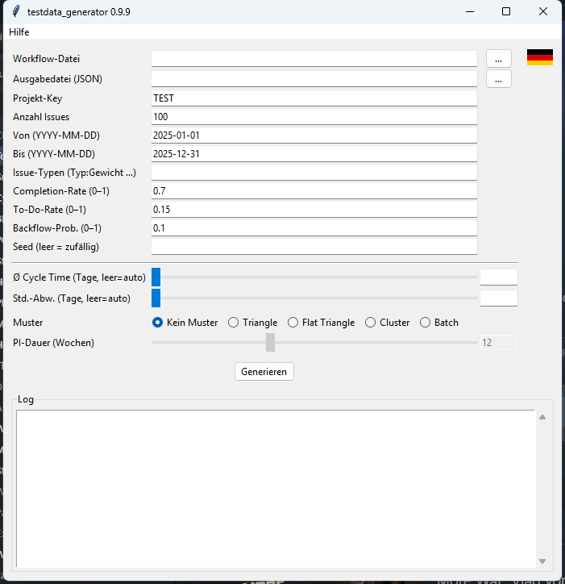

# testdata_generator

Generates synthetic Jira issue JSON files in Jira REST API format.
The generated files can be processed directly by `transform_data` and are
suitable for development, testing, and demonstrations without real Jira data.

**Status:** available (Alpha)

---

## Interface



## Start

### GUI

```bash
python -m testdata_generator
```

Or via the start script in the portable package:

- **Windows:** `TestdataGenerator.bat`
- **macOS:** `TestdataGenerator.command`
- **Linux:** `TestdataGenerator.sh`

### Command line

```bash
python -m testdata_generator \
    --workflow workflow_ART_A.txt \
    --project ART_A_GEN \
    --issues 200 \
    --seed 42 \
    --output ART_A_generated.json
```

## Parameters

| Parameter | Default | Description |
|-----------|---------|-------------|
| `--workflow FILE` | (required) | Workflow definition file |
| `--output FILE.json` | `<project>_generated.json` | Output file |
| `--project KEY` | `TEST` | Jira project key |
| `--issues N` | `100` | Number of issues to generate |
| `--from-date YYYY-MM-DD` | `2025-01-01` | Earliest creation date |
| `--to-date YYYY-MM-DD` | `2025-12-31` | Latest transition date |
| `--issue-types TYPE:W …` | `Feature:0.6 Bug:0.3 Enabler:0.1` | Issue types with weights |
| `--completion-rate FLOAT` | `0.7` | Fraction of closed issues (0–1) |
| `--todo-rate FLOAT` | `0.15` | Fraction of open issues in To Do stages (0–1) |
| `--backflow-prob FLOAT` | `0.1` | Probability of backward transitions (0–1) |
| `--seed INT` | (random) | Seed for reproducible output |
| `--mean-cycle-days FLOAT` | (none) | Target mean cycle time in days (lognormal) |
| `--std-cycle-days FLOAT` | (30 % of mean) | Standard deviation of cycle time |
| `--pattern PATTERN` | `none` | Flow anti-pattern: `none` / `triangle` / `flat_triangle` / `cluster` / `batch` |
| `--pi-duration-weeks INT` | `12` | PI cycle length in weeks (for `cluster`/`batch`) |

## Flow Patterns

Use `--mean-cycle-days` together with `--pattern` to simulate typical flow anti-patterns:

| Pattern | Description |
|---------|-------------|
| `none` | Random cycle time without shape (default) |
| `triangle` | Cycle time increases linearly over time — triangle shape in the scatter plot |
| `flat_triangle` | Like `triangle`, but the increase flattens toward the end (tanh) |
| `cluster` | Deliveries cluster in the last 2 weeks of each PI (Beta distribution) |
| `batch` | PI clustering with highly variable cycle time (0.1× to 3× mean) |

```bash
# Triangle pattern with mean cycle time of 30 days
python -m testdata_generator \
    --workflow workflow.txt \
    --pattern triangle \
    --mean-cycle-days 30 \
    --std-cycle-days 10 \
    --output triangle.json
```

## Workflow file

Same format as in `transform_data`:

```
CanonicalStageName:Alias1:Alias2
<First>StageName
<Closed>StageName
```

## Output and further processing

```bash
# Generate
python -m testdata_generator --workflow workflow.txt --project ART_TEST --seed 1

# Process directly with transform_data
python -m transform_data ART_TEST_generated.json workflow.txt
```

The generated JSON file contains Jira changelog histories with status transitions
along the defined workflow. `transform_data` processes them into
`IssueTimes.xlsx`, `CFD.xlsx`, and `Transitions.xlsx`.

## Architecture

```
testdata_generator/
├── __main__.py          Dispatcher: GUI without arguments, CLI with arguments
├── cli.py               run_generate() + argparse CLI
├── generator.py         Core logic: issue simulation
└── workflow_parser.py   Re-export from transform_data.workflow
```

## Tests

```bash
python -m pytest tests/testdata_generator/
```

## Note: Random cycle time distribution

The generator ensures that completed issues close **before** the configured `to-date`. The creation date is sampled from a restricted window `[from-date, latest_start]` where `latest_start` leaves enough buffer for the maximum cycle time. This produces an evenly distributed, random point cloud in the Flow Time scatter plot rather than a descending diagonal (right-censoring artefact).
