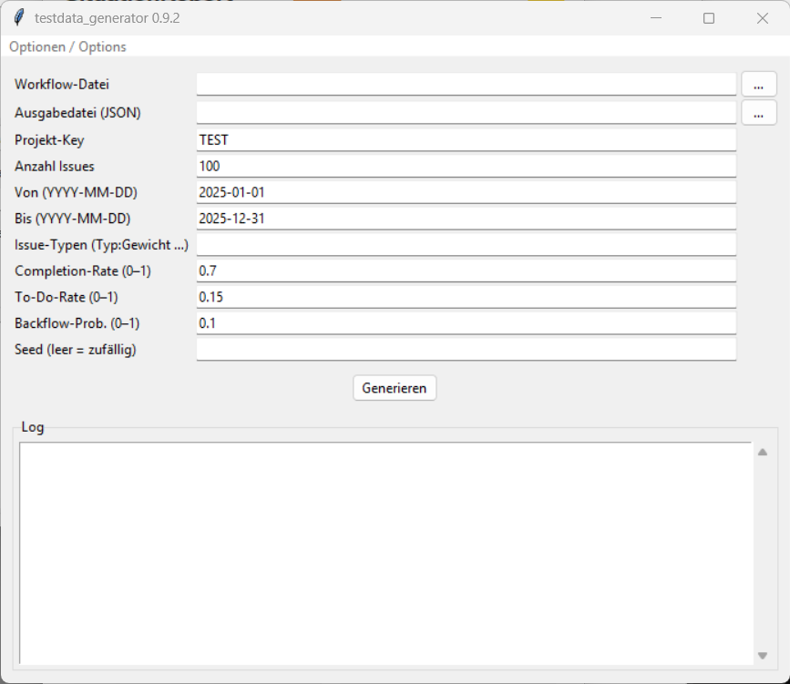

# testdata_generator

Erzeugt synthetische Jira-Issue-JSON-Dateien im Jira-REST-API-Format.
Die generierten Dateien sind direkt mit `transform_data` verarbeitbar und
eignen sich für Entwicklung, Tests und Demonstrationen ohne echte Jira-Daten.

**Status:** verfügbar (Alpha)

---

## Oberfläche



## Start

### GUI

```bash
python -m testdata_generator
```

Oder über die Startdatei im portablen Paket:

- **Windows:** `TestdataGenerator.bat`
- **macOS:** `TestdataGenerator.command`
- **Linux:** `TestdataGenerator.sh`

### Kommandozeile

```bash
python -m testdata_generator \
    --workflow workflow_ART_A.txt \
    --project ART_A_GEN \
    --issues 200 \
    --seed 42 \
    --output ART_A_generated.json
```

## Parameter

| Parameter | Standard | Beschreibung |
|-----------|---------|-------------|
| `--workflow FILE` | (Pflicht) | Workflow-Definitionsdatei |
| `--output FILE.json` | `<project>_generated.json` | Ausgabedatei |
| `--project KEY` | `TEST` | Jira-Projekt-Key |
| `--issues N` | `100` | Anzahl zu generierender Issues |
| `--from-date YYYY-MM-DD` | `2025-01-01` | Frühestes Erstellungsdatum |
| `--to-date YYYY-MM-DD` | `2025-12-31` | Spätestes Übergangsdatum |
| `--issue-types TYPE:W …` | `Feature:0.6 Bug:0.3 Enabler:0.1` | Issue-Typen mit Gewichtung |
| `--completion-rate FLOAT` | `0.7` | Anteil abgeschlossener Issues (0–1) |
| `--todo-rate FLOAT` | `0.15` | Anteil offener Issues in To-Do-Stages (0–1) |
| `--backflow-prob FLOAT` | `0.1` | Wahrscheinlichkeit für Rückschritte (0–1) |
| `--seed INT` | (zufällig) | Seed für reproduzierbare Ausgabe |

## Workflow-Datei

Dasselbe Format wie in `transform_data`:

```
CanonicalStageName:Alias1:Alias2
<First>StageName
<Closed>StageName
```

## Ausgabe und Weiterverarbeitung

```bash
# Generieren
python -m testdata_generator --workflow workflow.txt --project ART_TEST --seed 1

# Direkt mit transform_data verarbeiten
python -m transform_data ART_TEST_generated.json workflow.txt
```

Die generierte JSON-Datei enthält Jira-Changelog-Historien mit Status-Übergängen
entlang des definierten Workflows. `transform_data` verarbeitet sie zu
`IssueTimes.xlsx`, `CFD.xlsx` und `Transitions.xlsx`.

## Architektur

```
testdata_generator/
├── __main__.py          Dispatcher: GUI ohne Argumente, CLI mit Argumenten
├── cli.py               run_generate() + argparse CLI
├── generator.py         Kernlogik: Issue-Simulation
└── workflow_parser.py   Re-Export von transform_data.workflow
```

## Tests

```bash
python -m pytest tests/testdata_generator/
```
